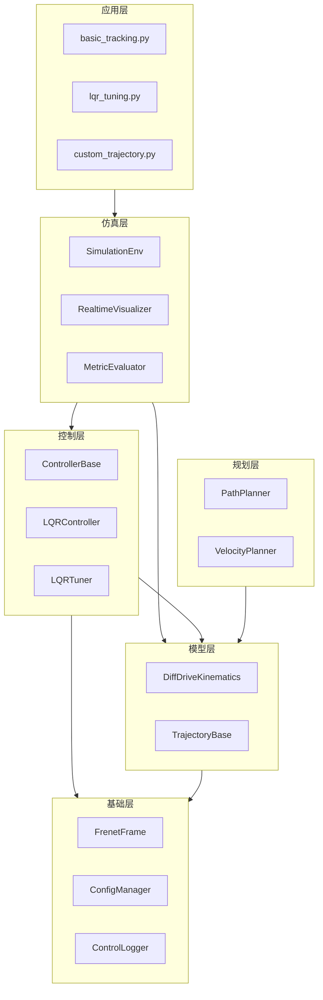
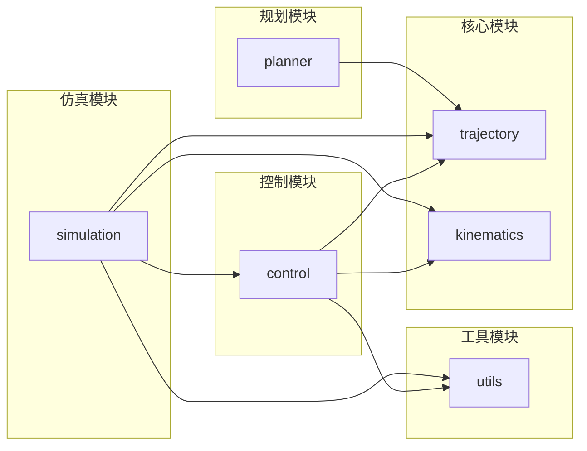
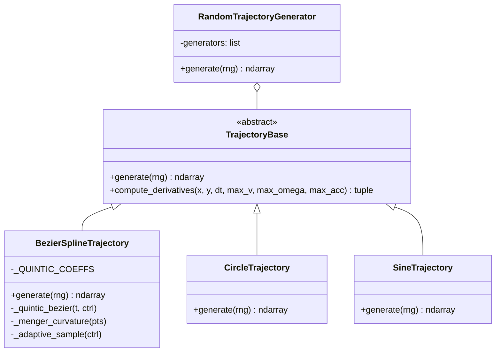
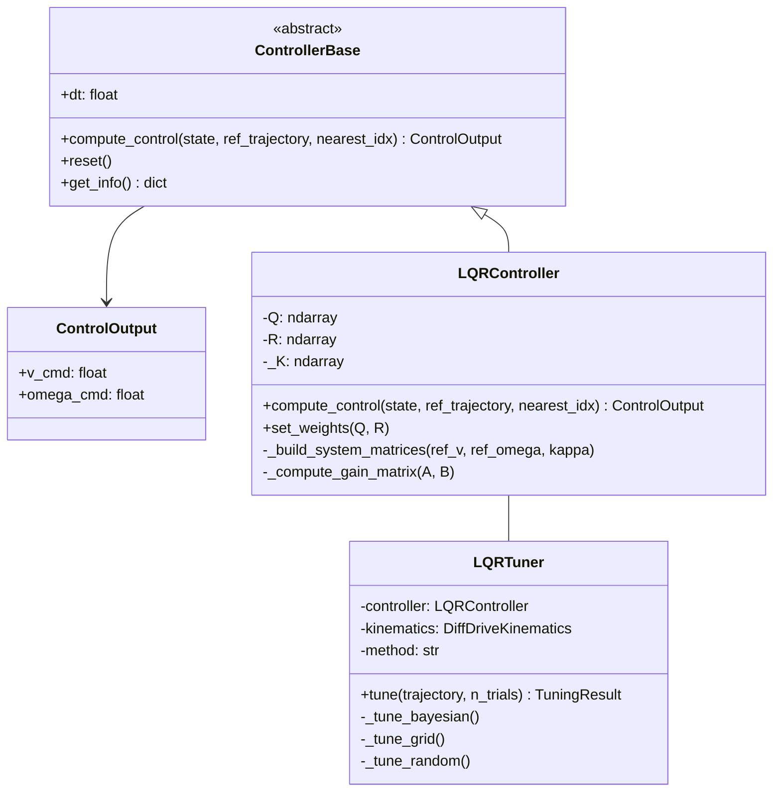
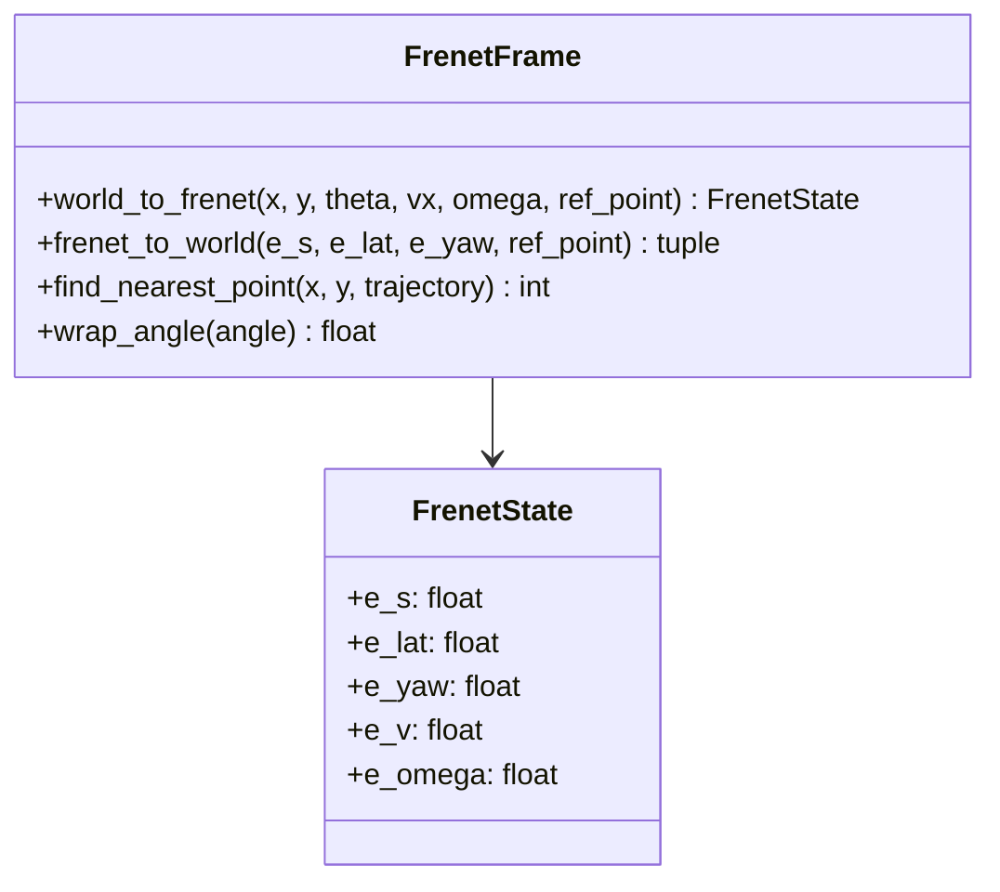
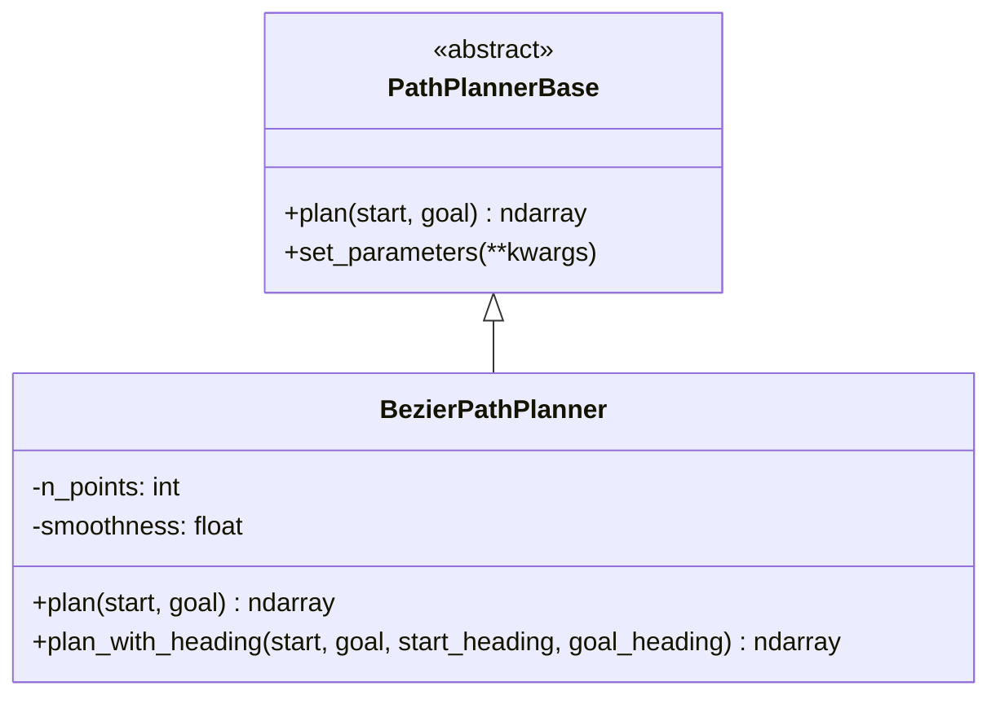
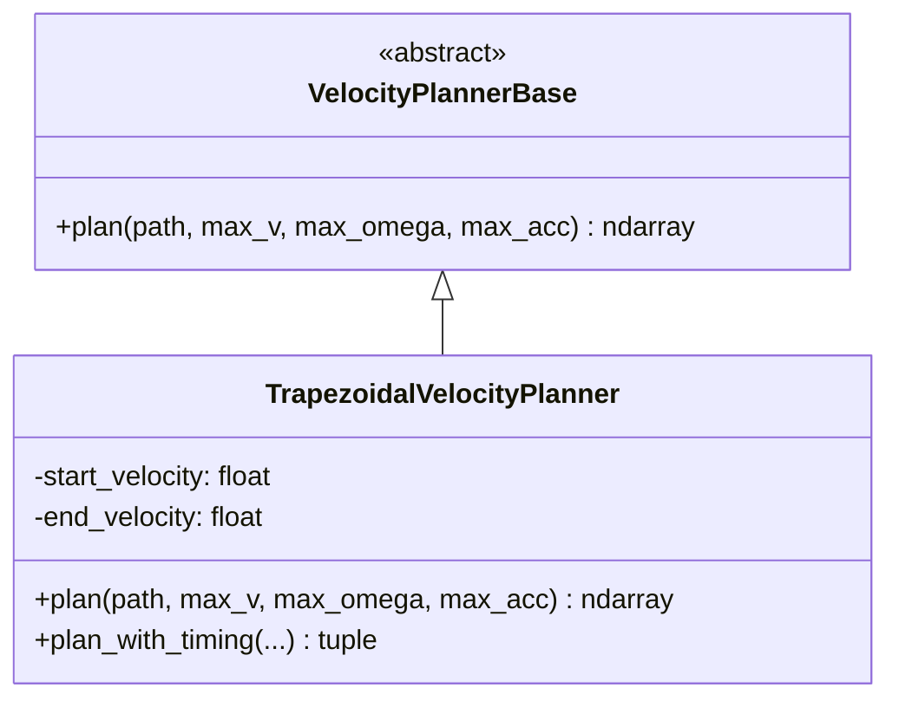
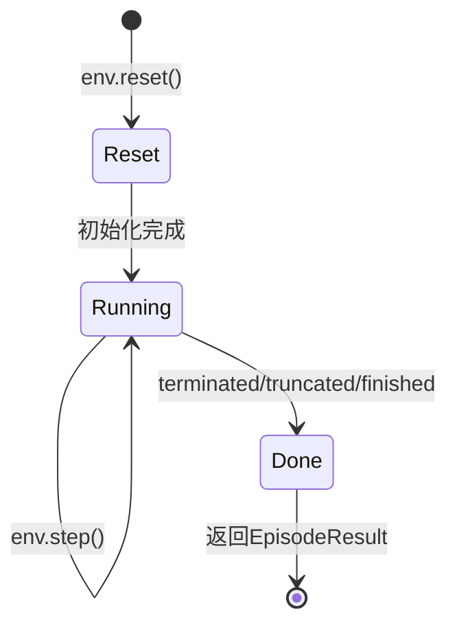
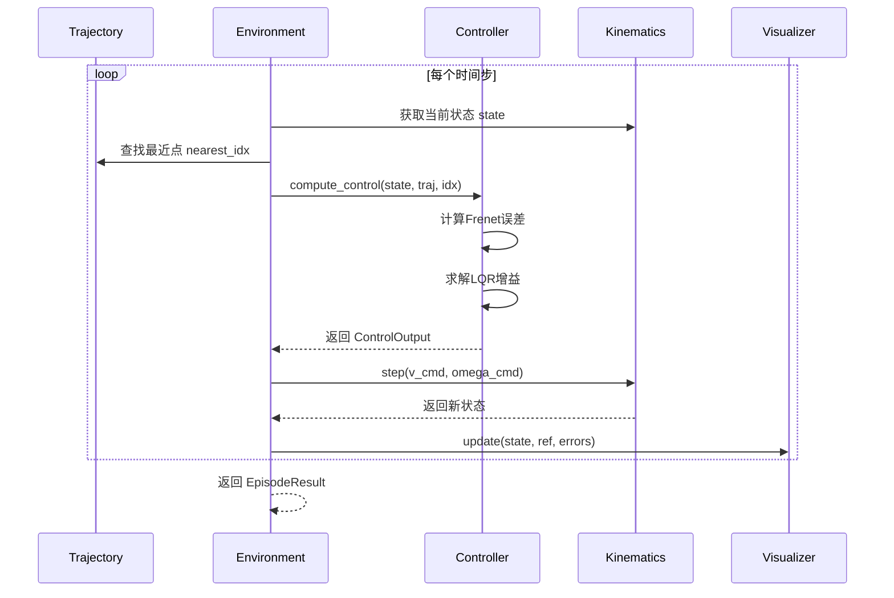
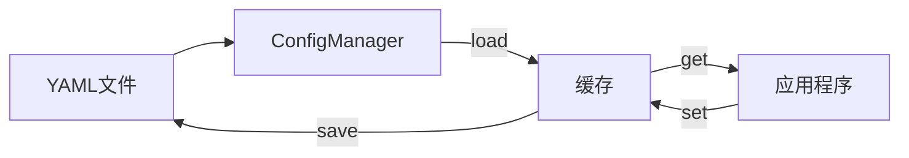

# Wheel Control 架构说明文档

## 目录

1. [系统概述](#系统概述)
2. [架构设计](#架构设计)
3. [模块详解](#模块详解)
4. [数据流](#数据流)
5. [接口设计](#接口设计)
6. [扩展指南](#扩展指南)

---

## 系统概述

Wheel Control 是一个模块化的差分车轮机器人轨迹跟踪控制系统，采用分层架构设计，支持多种控制器、规划器的灵活组合。

### 核心特性

- **Frenet坐标系误差建模**: 位置无关的误差表示，便于控制器设计
- **LQR最优控制**: 基于线性二次调节器的轨迹跟踪
- **模块化设计**: 控制器、规划器、轨迹生成器均可独立扩展
- **实时可视化**: 多子图实时显示跟踪过程
- **参数自整定**: 支持多种优化方法自动调参

### 系统边界

```
┌─────────────────────────────────────────────────────────┐
│                    Wheel Control System                  │
│  ┌─────────────┐  ┌─────────────┐  ┌─────────────────┐  │
│  │  Trajectory │  │   Control   │  │   Simulation    │  │
│  │   Generator │──│   Module    │──│   Environment   │  │
│  └─────────────┘  └─────────────┘  └─────────────────┘  │
│                          │                              │
│                   ┌──────┴──────┐                       │
│                   │  Kinematics │                       │
│                   └─────────────┘                       │
└─────────────────────────────────────────────────────────┘
         │                              │
         ▼                              ▼
    [配置文件]                      [可视化输出]
    [日志文件]                      [性能指标]
```

---

## 架构设计

### 分层架构



### 模块依赖关系



---

## 模块详解

### 1. 轨迹模块 (`trajectory/`)

#### 职责
- 生成参考轨迹
- 计算轨迹导数（yaw, velocity, omega, curvature）
- 提供轨迹数据标准化格式

#### 类图



#### 轨迹数据格式

| 列索引 | 符号 | 含义 | 单位 |
|--------|------|------|------|
| 0 | X | X坐标 | m |
| 1 | Y | Y坐标 | m |
| 2 | YAW | 航向角 | rad |
| 3 | VX | 线速度 | m/s |
| 4 | VY | 侧向速度（恒为0） | m/s |
| 5 | W | 角速度 | rad/s |
| 6 | KAPPA | 曲率 | 1/m |

---

### 2. 运动学模块 (`kinematics/`)

#### 职责
- 差分驱动机器人运动学模型
- 状态积分更新
- 执行器一阶惯性模型

#### 状态空间

```
状态向量: [x, y, θ, v, ω]
- x, y: 世界坐标系位置
- θ: 航向角
- v: 线速度
- ω: 角速度
```

#### 运动学方程

```
ẋ = v·cos(θ)
ẏ = v·sin(θ)
θ̇ = ω

执行器动态:
v̇ = (v_cmd - v) / τ_v
ω̇ = (ω_cmd - ω) / τ_ω
```

---

### 3. 控制模块 (`control/`)

#### 职责
- 轨迹跟踪控制
- LQR最优控制律计算
- 参数自整定

#### 类图



#### LQR控制律

**状态向量（Frenet坐标系）:**
```
e = [e_lat, e_yaw, e_v, e_ω]ᵀ
```

**控制律:**
```
u = -K·e + u_ff
```

其中:
- `K`: LQR增益矩阵
- `u_ff`: 前馈控制（来自参考轨迹）

**权重矩阵:**
```
Q = diag([q_lat, q_yaw, q_v, q_ω])  # 状态权重
R = diag([r_v, r_ω])                 # 控制权重
```

---

### 4. 工具模块 (`utils/`)

#### 4.1 Frenet坐标转换 (`frenet.py`)



**坐标转换公式:**
```
e_lat = -sin(θ_ref)·(x - x_ref) + cos(θ_ref)·(y - y_ref)
e_yaw = wrap(θ - θ_ref)
```

#### 4.2 配置管理 (`config.py`)

```python
class ConfigManager:
    """YAML配置管理器，支持热加载"""
    
    def load(name: str) -> dict
    def reload(name: str) -> dict
    def get(key: str, default) -> Any
    def set(key: str, value: Any)
    def save(name: str, config: dict)
```

#### 4.3 日志系统 (`logger.py`)

```python
class ControlLogger:
    """控制过程日志记录"""
    
    def start_episode()
    def log_step(data: StepData)
    def end_episode() -> str
    def export_csv(path: str) -> Path
    def export_summary(path: str) -> Path
```

---

### 5. 规划模块 (`planner/`)

#### 5.1 路径规划器



#### 5.2 速度规划器



**梯形速度规划:**
1. 曲率限制: `v_limit = min(max_v, max_ω / |κ|)`
2. 前向传播（加速度限制）
3. 后向传播（减速度限制）
4. 取最小值并平滑

---

### 6. 仿真模块 (`simulation/`)

#### 6.1 仿真环境 (`env.py`)



#### 6.2 可视化器 (`visualizer.py`)

**多子图布局:**
```
┌──────────────────┬──────────────────┬──────────────────┐
│   轨迹跟踪图      │    横向误差      │    航向误差      │
│   (XY平面)       │    曲线          │    曲线          │
├──────────────────┼──────────────────┼──────────────────┤
│   速度曲线       │    曲率曲线      │   速度误差       │
│  (ref vs actual) │                  │                  │
└──────────────────┴──────────────────┴──────────────────┘
```

#### 6.3 性能指标 (`metrics.py`)

| 指标 | 公式 | 含义 |
|------|------|------|
| `rms_lateral_error` | √(mean(e_lat²)) | 横向误差RMS |
| `max_lateral_error` | max(|e_lat|) | 最大横向误差 |
| `rms_yaw_error` | √(mean(e_yaw²)) | 航向误差RMS |
| `rms_velocity_error` | √(mean(e_v²)) | 速度误差RMS |
| `control_smoothness` | √(mean(jerk²)) | 控制平滑度 |

---

## 数据流

### 控制循环数据流



### 配置加载流程



---

## 接口设计

### 控制器接口

```python
class ControllerBase(ABC):
    @abstractmethod
    def compute_control(
        self,
        state: np.ndarray,          # [x, y, theta, vx, omega]
        ref_trajectory: np.ndarray, # (N, 7)
        nearest_idx: int,
    ) -> ControlOutput:
        """计算控制指令"""
    
    @abstractmethod
    def reset(self) -> None:
        """重置控制器内部状态"""
```

### 轨迹生成器接口

```python
class TrajectoryBase(ABC):
    @abstractmethod
    def generate(
        self,
        rng: np.random.Generator | None = None
    ) -> np.ndarray:
        """生成轨迹，返回 (N, 7) 数组"""
```

### 规划器接口

```python
class PathPlannerBase(ABC):
    @abstractmethod
    def plan(
        self,
        start: np.ndarray,  # [x, y] 或 [x, y, theta]
        goal: np.ndarray,
    ) -> np.ndarray:       # (N, 2)
        """规划路径"""

class VelocityPlannerBase(ABC):
    @abstractmethod
    def plan(
        self,
        path: np.ndarray,   # (N, 2)
        max_v: float,
        max_omega: float,
        max_acc: float,
    ) -> np.ndarray:       # (N,)
        """规划速度曲线"""
```

---

## 扩展指南

### 添加新的控制器

```python
# wheel_control/control/my_controller.py

from .base import ControllerBase, ControlOutput

class MyController(ControllerBase):
    def __init__(self, param1, param2, **kwargs):
        super().__init__(**kwargs)
        self.param1 = param1
        self.param2 = param2
    
    def compute_control(self, state, ref_trajectory, nearest_idx):
        # 1. 计算误差
        # 2. 应用控制算法
        # 3. 返回控制指令
        return ControlOutput(v_cmd=..., omega_cmd=...)
    
    def reset(self):
        # 重置内部状态
        pass
```

### 添加新的轨迹生成器

```python
# wheel_control/trajectory/my_trajectory.py

from .base import TrajectoryBase

class MyTrajectory(TrajectoryBase):
    def __init__(self, custom_param, **kwargs):
        super().__init__(**kwargs)
        self.custom_param = custom_param
    
    def generate(self, rng=None):
        # 生成 x, y 坐标
        x = ...
        y = ...
        
        # 使用基类方法计算导数
        yaw, vx, omega, kappa = self.compute_derivatives(
            x, y, self.dt, self.max_v, self.max_omega, self.max_acc
        )
        vy = np.zeros_like(x)
        
        return np.stack([x, y, yaw, vx, vy, omega, kappa], axis=1)
```

### 添加新的规划器

```python
# wheel_control/planner/path/my_planner.py

class MyPathPlanner:
    def plan(self, start, goal):
        # 实现路径规划算法
        return path  # (N, 2) 数组
```

---

## 性能考虑

### 计算复杂度

| 操作 | 复杂度 | 备注 |
|------|--------|------|
| LQR增益计算 | O(n³) | n=4（状态维度），可缓存 |
| 最近点搜索 | O(N) | N=轨迹点数，可优化为O(log N) |
| 运动学积分 | O(1) | 每步常数时间 |

### 优化建议

1. **LQR增益缓存**: 当曲率变化小于阈值时复用K矩阵
2. **最近点搜索**: 使用KD树或限制搜索范围
3. **向量化计算**: 使用numpy向量化操作代替循环

---

## 配置参考

### 完整配置示例

```yaml
# config/default.yaml

simulation:
  dt: 0.02              # 时间步长 (s)
  max_steps: 1000       # 最大步数
  lateral_limit: 0.5    # 横向误差限制 (m)
  init_noise: 0.1       # 初始位置噪声 (m)

robot:
  wheel_base: 0.3       # 轮距 (m)
  wheel_radius: 0.05    # 轮半径 (m)
  max_v: 1.5            # 最大线速度 (m/s)
  max_omega: 3.0        # 最大角速度 (rad/s)
  tau_v: 0.1            # 线速度时间常数 (s)
  tau_omega: 0.08       # 角速度时间常数 (s)
  v_acc_max: 3.0        # 最大线加速度 (m/s²)
  w_acc_max: 10.0       # 最大角加速度 (rad/s²)

trajectory:
  types: [bezier_spline, circle, sine]
  n_points: 600
  dist_range: [0.5, 3.0]
  lateral_error_range: [0.0, 0.2]
  heading_error_deg_range: [0.0, 20.0]

logging:
  level: INFO
  save_csv: true
  log_dir: logs

visualization:
  enabled: true
  realtime: true
  figsize: [14, 10]
```

---

## 附录

### A. 坐标系定义

**世界坐标系:**
- X轴: 指向右侧
- Y轴: 指向上方
- θ: 从X轴逆时针旋转的角度

**Frenet坐标系:**
- s: 沿轨迹切向的弧长
- d: 垂直于轨迹的横向偏移（左侧为正）

### B. 符号表

| 符号 | 含义 | 单位 |
|------|------|------|
| x, y | 世界坐标 | m |
| θ | 航向角 | rad |
| v | 线速度 | m/s |
| ω | 角速度 | rad/s |
| κ | 曲率 | 1/m |
| τ | 时间常数 | s |
| Q, R | LQR权重矩阵 | - |

### C. 参考资料

1. Frenet坐标系: 基于路径的自然坐标系
2. LQR控制: 线性二次调节器理论
3. 差分驱动运动学: 非完整约束机器人模型
4. Bezier曲线: 参数化曲线设计
