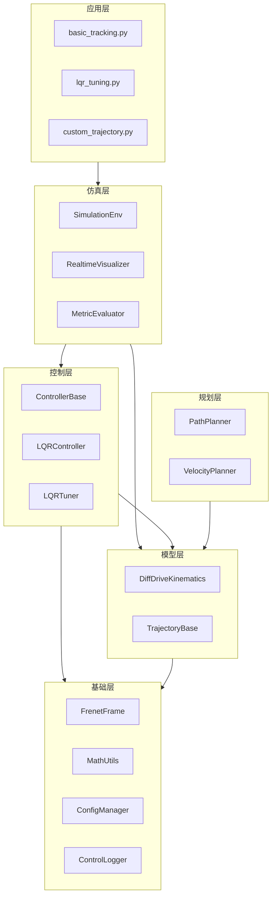
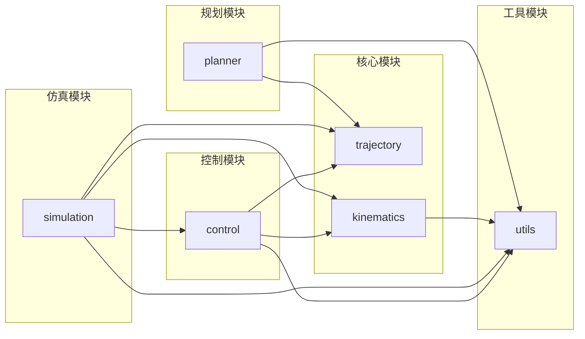
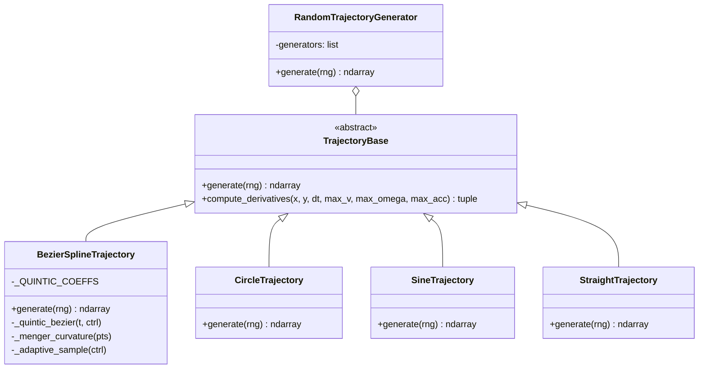
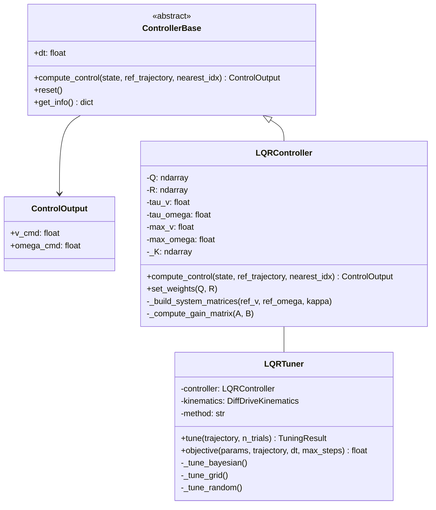
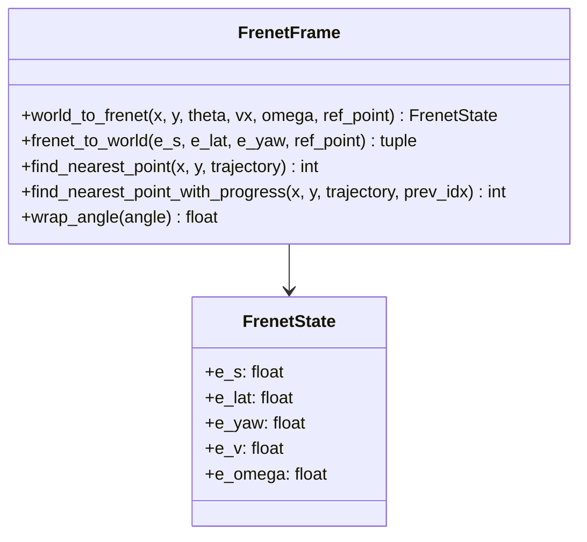
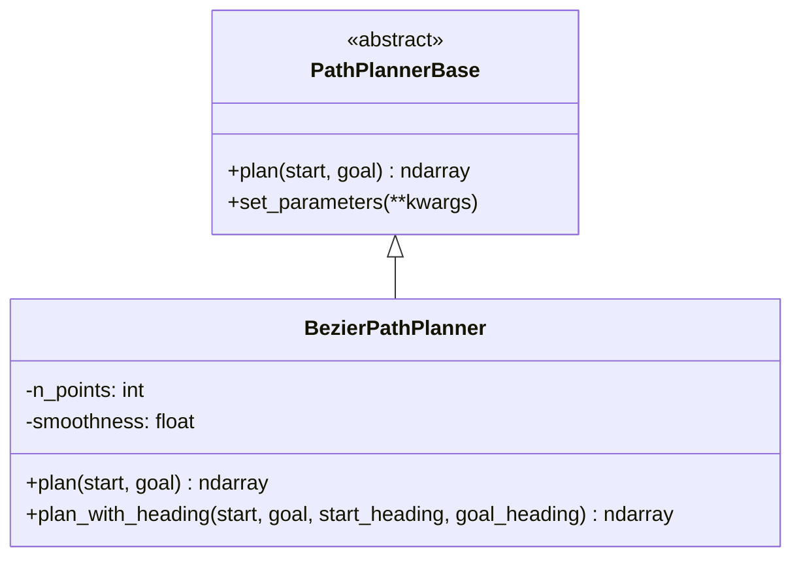
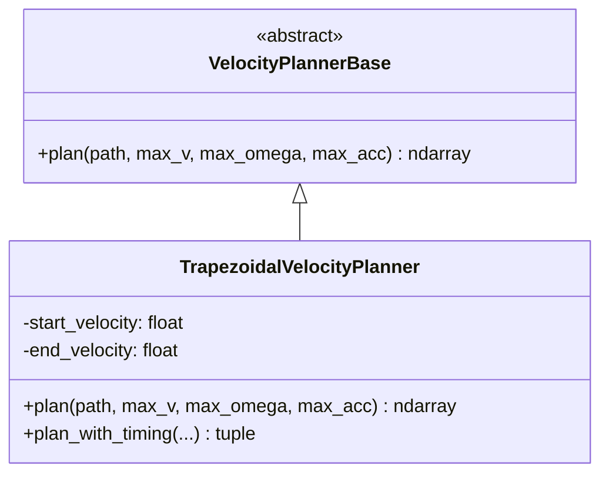
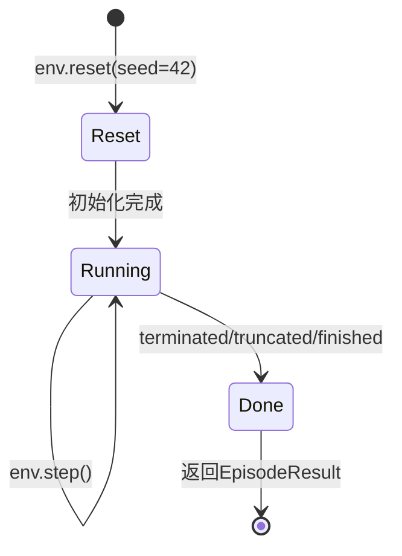
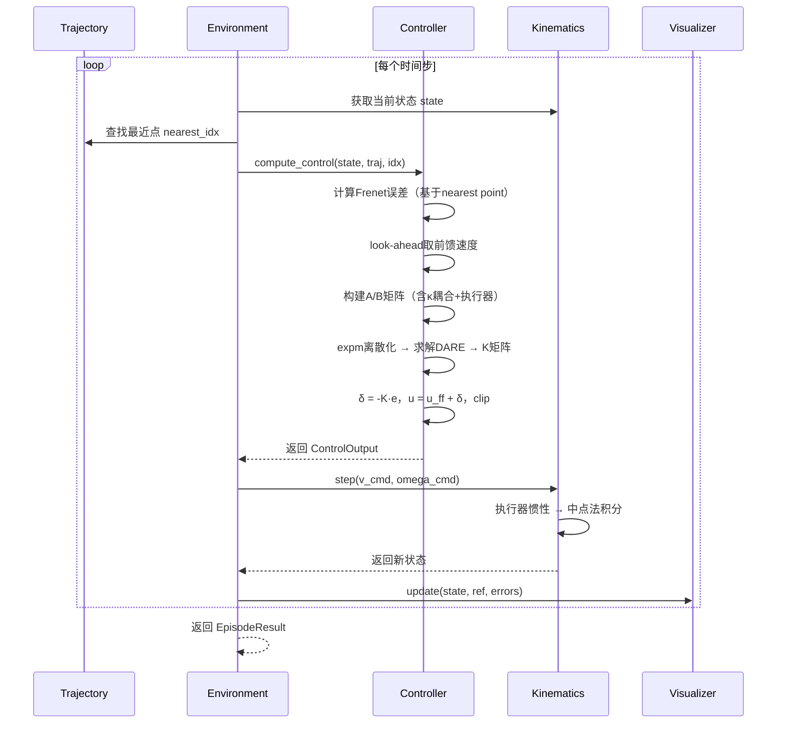
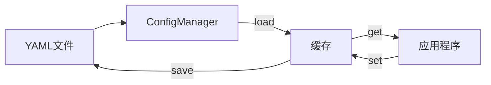

# Wheel Control 架构说明文档

## 目录

1. [系统概述](#系统概述)
2. [架构设计](#架构设计)
3. [模块详解](#模块详解)
4. [数据流](#数据流)
5. [接口设计](#接口设计)
6. [扩展指南](#扩展指南)

---

## 系统概述

Wheel Control 是一个模块化的差分车轮机器人轨迹跟踪控制系统，采用分层架构设计，支持多种控制器、规划器的灵活组合。

### 核心特性

- **Frenet坐标系误差建模**: 位置无关的误差表示，便于控制器设计
- **LQR最优控制**: 含曲率耦合、执行器动态、零速 look-ahead 前馈的完整 LQR
- **模块化设计**: 控制器、规划器、轨迹生成器均可独立扩展
- **实时可视化**: 基于 `set_data()` 增量更新的多子图实时显示
- **参数自整定**: 支持 Bayesian / Grid / Random 三种优化方法自动调参
- **可复现仿真**: `SimulationEnv` 支持 `seed` 参数，保证实验可复现

### 系统边界

```
┌─────────────────────────────────────────────────────────┐
│                    Wheel Control System                  │
│  ┌─────────────┐  ┌─────────────┐  ┌─────────────────┐  │
│  │  Trajectory │  │   Control   │  │   Simulation    │  │
│  │   Generator │──│   Module    │──│   Environment   │  │
│  └─────────────┘  └─────────────┘  └─────────────────┘  │
│                          │                              │
│                   ┌──────┴──────┐                       │
│                   │  Kinematics │                       │
│                   └─────────────┘                       │
└─────────────────────────────────────────────────────────┘
         │                              │
         ▼                              ▼
    [配置文件]                      [可视化输出]
    [日志文件]                      [性能指标]
```

---

## 架构设计

### 分层架构



### 模块依赖关系



---

## 模块详解

### 1. 轨迹模块 (`trajectory/`)

#### 职责
- 生成参考轨迹
- 计算轨迹导数（yaw, velocity, omega, curvature）
- 提供轨迹数据标准化格式

#### 速度规划流程

所有生成器（包括 Circle 和 Straight）统一通过 `compute_derivatives` 生成物理一致的速度曲线：

1. **几何**: yaw 通过 `np.unwrap(arctan2)` 计算；曲率通过参数化公式 `κ = (x'y'' - y'x'') / |r'|³`
2. **速度规划**: 先限制曲率上界 (`v ≤ max_ω / |κ|`)，再经过 forward-backward 加速度约束，保证 `|Δv²| ≤ 2·a_max·Δs`；首尾 `v[0] = v[-1] = 0`
3. **Gaussian 平滑**: 消除加速/匀速/减速切换处的加加速度不连续
4. **ω = κ·v**: 角速度由运动学耦合导出，不独立裁剪

#### 类图



#### 轨迹数据格式

| 列索引 | 符号 | 含义 | 单位 |
|--------|------|------|------|
| 0 | X | X坐标 | m |
| 1 | Y | Y坐标 | m |
| 2 | YAW | 航向角 | rad |
| 3 | VX | 线速度 | m/s |
| 4 | VY | 侧向速度（恒为0） | m/s |
| 5 | W | 角速度 | rad/s |
| 6 | KAPPA | 曲率 | 1/m |

---

### 2. 运动学模块 (`kinematics/`)

#### 职责
- 差分驱动机器人运动学模型
- 中点法状态积分（减少航向累积误差）
- 一阶执行器惯性 + 加速度 / 速度限幅

#### 状态空间

```
状态向量: [x, y, θ, v, ω]
- x, y: 世界坐标系位置
- θ: 航向角
- v: 线速度
- ω: 角速度
```

#### 运动学方程

```
执行器动态（含加速度限幅）:
v̇ = clip((v_cmd - v) / τ_v, ±a_max)
ω̇ = clip((ω_cmd - ω) / τ_ω, ±α_max)

中点法积分:
θ_mid = θ + ω·dt/2
x += v·cos(θ_mid)·dt
y += v·sin(θ_mid)·dt
θ += ω·dt
```

---

### 3. 控制模块 (`control/`)

#### 职责
- 轨迹跟踪控制
- LQR最优控制律计算（含曲率耦合与执行器动态）
- 参数自整定（通过 `SimulationEnv` 评估）

#### 类图



#### LQR 控制律

**状态向量（Frenet坐标系）:**
```
e = [e_lat, e_yaw, e_v, e_ω]ᵀ
```

**连续时间线性化误差动力学（含曲率耦合与执行器惯性）:**
```
ė_lat   =  v_ref · e_yaw
ė_yaw   = -v_ref · κ² · e_lat  -  κ · e_v  +  e_ω
ė_v     = -e_v / τ_v   +  δ_v / τ_v
ė_ω     = -e_ω / τ_ω   +  δ_ω / τ_ω
```

矩阵形式 `ė = A·e + B·δ`:
```
      ┌  0        v_ref    0        0     ┐       ┌  0       0     ┐
A  =  │ -v·κ²    0       -κ        1     │   B = │  0       0     │
      │  0        0       -1/τ_v    0     │       │  1/τ_v   0     │
      └  0        0        0       -1/τ_ω ┘       └  0       1/τ_ω ┘
```

**离散化:**
通过矩阵指数（ZOH）精确离散化，而非前向欧拉近似：
```
expm(┌ A  B ┐ · dt) = ┌ A_d  B_d ┐
     └ 0  0 ┘         └  0    I  ┘
```

**控制律:**
```
δ = -K · e              (反馈)
u = u_ff + δ            (前馈 + 反馈)
u_cmd = clip(u, ±u_max) (限幅)
```

**K 矩阵缓存策略:**

当以下任一条件满足时重新计算 K：
- `|κ_new - κ_cached| > 0.01`
- `|v_new - v_cached| > 0.05`

**零速 Look-ahead 前馈:**

当 `ref_v ≈ 0`（轨迹起步/减速段）时，系统不完全可控。此时：
1. 向前看 30 个轨迹点取速度前馈，使机器人能加速驶出零速区域
2. 线性化模型中对速度加下界 `v_model = max(|v_ff|, 0.05)` 保证可控性
3. Frenet 误差仍基于几何最近点计算

**权重矩阵:**
```
Q = diag([q_lat, q_yaw, q_v, q_ω])  # 状态权重
R = diag([r_v, r_ω])                 # 控制权重
```

**Riccati 方程求解失败的 fallback:**

若 `solve_discrete_are` 抛异常，优先复用上一次有效的 K；若无历史 K，回退到零矩阵（纯前馈模式）。

#### 调参模块 (`tuner.py`)

- 复用 `SimulationEnv`（`logging_enabled=False`）评估每组参数
- 固定 `seed=0` 保证同一轨迹上的评估可复现
- Random / Bayesian 搜索使用 **log-uniform** 采样，Grid 使用 `geomspace`

---

### 4. 工具模块 (`utils/`)

#### 4.1 数学工具 (`math_utils.py`)

统一的数学工具函数，所有模块中的 `wrap_angle`、`compute_curvature` 均委托于此，避免重复实现。

```python
class MathUtils:
    @staticmethod wrap_angle(angle) -> float | ndarray
    @staticmethod angle_diff(a, b) -> float
    @staticmethod compute_curvature(x, y) -> ndarray
    @staticmethod rotation_matrix(theta) -> ndarray
    @staticmethod normalize(v) -> ndarray
    @staticmethod smooth_signal(signal, window_size) -> ndarray
    @staticmethod linear_interpolate(x, x_arr, y_arr) -> float
```

#### 4.2 Frenet坐标转换 (`frenet.py`)



**坐标转换公式:**
```
e_lat = -sin(θ_ref)·(x - x_ref) + cos(θ_ref)·(y - y_ref)
e_yaw = wrap(θ - θ_ref)
```

#### 4.3 配置管理 (`config.py`)

```python
class ConfigManager:
    """YAML配置管理器，支持热加载与缓存"""

    def load(name: str) -> dict
    def reload(name: str) -> dict
    def get(key: str, default) -> Any    # dot-separated key, e.g. "robot.max_v"
    def set(key: str, value: Any)
    def save(name: str, config: dict)
    def merge(base_name, override_name) -> dict
```

#### 4.4 日志系统 (`logger.py`)

```python
class ControlLogger:
    """控制过程日志记录"""

    def start_episode()
    def log_step(data: StepData)
    def end_episode() -> str
    def export_csv(path, data=None) -> Path   # 可传入外部 data；为空时回退到最后一次 episode
    def export_summary(path) -> Path
```

---

### 5. 规划模块 (`planner/`)

> **注意**: 规划模块目前未接入主仿真流水线，作为独立工具存在。如需集成，需将 planner 输出转换为 `(N, 7)` 轨迹格式。

#### 5.1 路径规划器



#### 5.2 速度规划器



**梯形速度规划:**
1. 曲率限制: `v_limit = min(max_v, max_ω / |κ|)`
2. 前向传播（加速度限制）
3. 后向传播（减速度限制）
4. 取最小值并平滑

---

### 6. 仿真模块 (`simulation/`)

#### 6.1 仿真环境 (`env.py`)



关键特性：
- `seed` 参数控制初始噪声，保证可复现
- `logging_enabled=False` 可关闭日志（调参时使用）
- `export_log()` 在 `run_episode()` 之后仍可正常调用

#### 6.2 可视化器 (`visualizer.py`)

使用 `set_data()` 增量更新 line 对象，而非每帧 `clear()` + `plot()`，显著提升实时性能。

**多子图布局:**
```
┌──────────────────┬──────────────────┬──────────────────┐
│   轨迹跟踪图      │    横向误差      │    航向误差      │
│   (XY平面)       │    曲线          │    曲线          │
├──────────────────┼──────────────────┼──────────────────┤
│   速度曲线       │    曲率曲线      │   速度误差       │
│  (ref vs actual) │   (静态参考)     │                  │
└──────────────────┴──────────────────┴──────────────────┘
```

#### 6.3 性能指标 (`metrics.py`)

| 指标 | 公式 | 含义 |
|------|------|------|
| `rms_lateral_error` | √(mean(e_lat²)) | 横向误差RMS |
| `max_lateral_error` | max(\|e_lat\|) | 最大横向误差 |
| `rms_yaw_error` | √(mean(e_yaw²)) | 航向误差RMS |
| `rms_velocity_error` | √(mean(e_v²)) | 速度误差RMS |
| `control_smoothness` | √(mean(jerk²)) | 控制平滑度 |

---

## 数据流

### 控制循环数据流



### 配置加载流程



---

## 接口设计

### 控制器接口

```python
class ControllerBase(ABC):
    @abstractmethod
    def compute_control(
        self,
        state: np.ndarray,          # [x, y, theta, vx, omega]
        ref_trajectory: np.ndarray, # (N, 7)
        nearest_idx: int,
    ) -> ControlOutput:
        """计算控制指令"""

    @abstractmethod
    def reset(self) -> None:
        """重置控制器内部状态"""
```

### LQR控制器构造

```python
LQRController(
    dt=0.02,
    Q=[1.0, 2.0, 0.5, 0.5],     # 状态权重
    R=[0.1, 0.1],                 # 控制权重
    tau_v=0.1,                    # 线速度执行器时间常数
    tau_omega=0.08,               # 角速度执行器时间常数
    max_v=1.5,                    # 输出限幅
    max_omega=3.0,                # 输出限幅
)
```

### 轨迹生成器接口

```python
class TrajectoryBase(ABC):
    @abstractmethod
    def generate(
        self,
        rng: np.random.Generator | None = None
    ) -> np.ndarray:
        """生成轨迹，返回 (N, 7) 数组"""
```

### 仿真环境接口

```python
env = SimulationEnv(
    trajectory=traj,
    controller=ctrl,
    kinematics=kin,
    config={
        "dt": 0.02,
        "max_steps": 1000,
        "lateral_limit": 0.5,
        "init_noise": 0.1,
        "logging_enabled": True,   # 调参时设为 False
    },
)

state = env.reset(seed=42)                 # 可复现初始化
result = env.run_episode(seed=42)          # 或一键跑完
log_path = env.export_log()                # run_episode 之后仍可调用
```

### 规划器接口

```python
class PathPlannerBase(ABC):
    @abstractmethod
    def plan(
        self,
        start: np.ndarray,  # [x, y] 或 [x, y, theta]
        goal: np.ndarray,
    ) -> np.ndarray:       # (N, 2)
        """规划路径"""

class VelocityPlannerBase(ABC):
    @abstractmethod
    def plan(
        self,
        path: np.ndarray,   # (N, 2)
        max_v: float,
        max_omega: float,
        max_acc: float,
    ) -> np.ndarray:       # (N,)
        """规划速度曲线"""
```

---

## 扩展指南

### 添加新的控制器

```python
# wheel_control/control/my_controller.py

from .base import ControllerBase, ControlOutput

class MyController(ControllerBase):
    def __init__(self, param1, param2, **kwargs):
        super().__init__(**kwargs)
        self.param1 = param1
        self.param2 = param2

    def compute_control(self, state, ref_trajectory, nearest_idx):
        # 1. 计算误差
        # 2. 应用控制算法
        # 3. 返回控制指令
        return ControlOutput(v_cmd=..., omega_cmd=...)

    def reset(self):
        pass
```

### 添加新的轨迹生成器

```python
# wheel_control/trajectory/my_trajectory.py

from .base import TrajectoryBase

class MyTrajectory(TrajectoryBase):
    def __init__(self, custom_param, dt=0.02, max_v=1.5,
                 max_omega=3.0, max_acc=1.0, n_points=600):
        self.custom_param = custom_param
        self.dt = dt
        self.max_v = max_v
        self.max_omega = max_omega
        self.max_acc = max_acc
        self.n_points = n_points

    def generate(self, rng=None):
        # 生成 x, y 坐标
        x = ...
        y = ...

        # 使用基类方法计算导数（含加减速规划）
        yaw, vx, omega, kappa = self.compute_derivatives(
            x, y, self.dt, self.max_v, self.max_omega, self.max_acc
        )
        vy = np.zeros_like(x)

        return np.stack([x, y, yaw, vx, vy, omega, kappa], axis=1)
```

### 添加新的规划器

```python
# wheel_control/planner/path/my_planner.py

class MyPathPlanner:
    def plan(self, start, goal):
        # 实现路径规划算法
        return path  # (N, 2) 数组
```

---

## 测试

### 测试结构

```
tests/
├── test_controller.py      # LQR 单元测试（初始化、输出、限幅、Q/R设置）
├── test_frenet.py           # Frenet 坐标变换单元测试
├── test_simulation.py       # 仿真环境与指标评估器单元测试
├── test_trajectory.py       # 轨迹生成器单元测试
└── test_integration.py      # 集成测试（端到端收敛验证）
```

### 集成测试

`test_integration.py` 运行完整的 **轨迹→控制→运动学→指标** 流水线，验证：

- 4 种轨迹类型（Circle / Straight / Sine / Bezier）均能完整跟踪
- RMS 横向误差 < 阈值（通常 0.10 ~ 0.15 m）
- 所有测试使用 `seed=42` 保证可复现

```bash
python -m pytest tests/ -v
```

---

## 性能考虑

### 计算复杂度

| 操作 | 复杂度 | 备注 |
|------|--------|------|
| LQR增益计算（DARE + expm） | O(n³) | n=4（状态维度），按需缓存 |
| 最近点搜索 | O(W) | W=搜索窗口（默认50点） |
| 运动学积分（中点法） | O(1) | 每步常数时间 |

### 已实现的优化

1. **LQR增益缓存**: 当曲率变化 < 0.01 且速度变化 < 0.05 时复用 K 矩阵
2. **最近点搜索**: `find_nearest_point_with_progress` 限制搜索范围为前一索引 +50
3. **可视化增量更新**: `set_data()` 替代 `clear()` + `plot()`
4. **调参免日志**: `logging_enabled=False` 避免调参时的 I/O 开销

---

## 配置参考

### 完整配置示例

```yaml
# config/robot.yaml
wheel_base: 0.3       # 轮间距 (m)
wheel_radius: 0.05    # 轮半径 (m)
max_v: 1.5            # 最大线速度 (m/s)
max_omega: 3.0        # 最大角速度 (rad/s)
tau_v: 0.1            # 线速度时间常数 (s)
tau_omega: 0.08       # 角速度时间常数 (s)
v_acc_max: 3.0        # 最大线加速度 (m/s²)
w_acc_max: 10.0       # 最大角加速度 (rad/s²)

# config/simulation.yaml
dt: 0.02              # 时间步长 (s)
max_steps: 1000       # 最大步数
lateral_limit: 0.5    # 横向误差限制 (m)
init_noise: 0.1       # 初始位置噪声 (m)

# config/controller/lqr.yaml
Q: [1.0, 2.0, 0.5, 0.5]   # [e_lat, e_yaw, e_v, e_omega]
R: [0.1, 0.1]              # [delta_v, delta_omega]
tuner:
  enabled: false
  method: bayesian          # bayesian / grid / random
  n_trials: 50
  q_range: [0.1, 10.0]
  r_range: [0.01, 1.0]
  objective: rms_lateral_error
```

---

## 附录

### A. 坐标系定义

**世界坐标系:**
- X轴: 指向右侧
- Y轴: 指向上方
- θ: 从X轴逆时针旋转的角度

**Frenet坐标系:**
- s: 沿轨迹切向的弧长
- d: 垂直于轨迹的横向偏移（左侧为正）

### B. 符号表

| 符号 | 含义 | 单位 |
|------|------|------|
| x, y | 世界坐标 | m |
| θ | 航向角 | rad |
| v | 线速度 | m/s |
| ω | 角速度 | rad/s |
| κ | 曲率 | 1/m |
| τ_v, τ_ω | 执行器时间常数 | s |
| Q, R | LQR权重矩阵 | - |
| K | LQR增益矩阵 | - |
| A, B | 系统矩阵（连续/离散） | - |

### C. 参考资料

1. Frenet坐标系: 基于路径的自然坐标系
2. LQR控制: 线性二次调节器理论
3. 差分驱动运动学: 非完整约束机器人模型
4. Bezier曲线: 参数化曲线设计
5. 矩阵指数离散化: ZOH (Zero-Order Hold) 精确离散化方法
